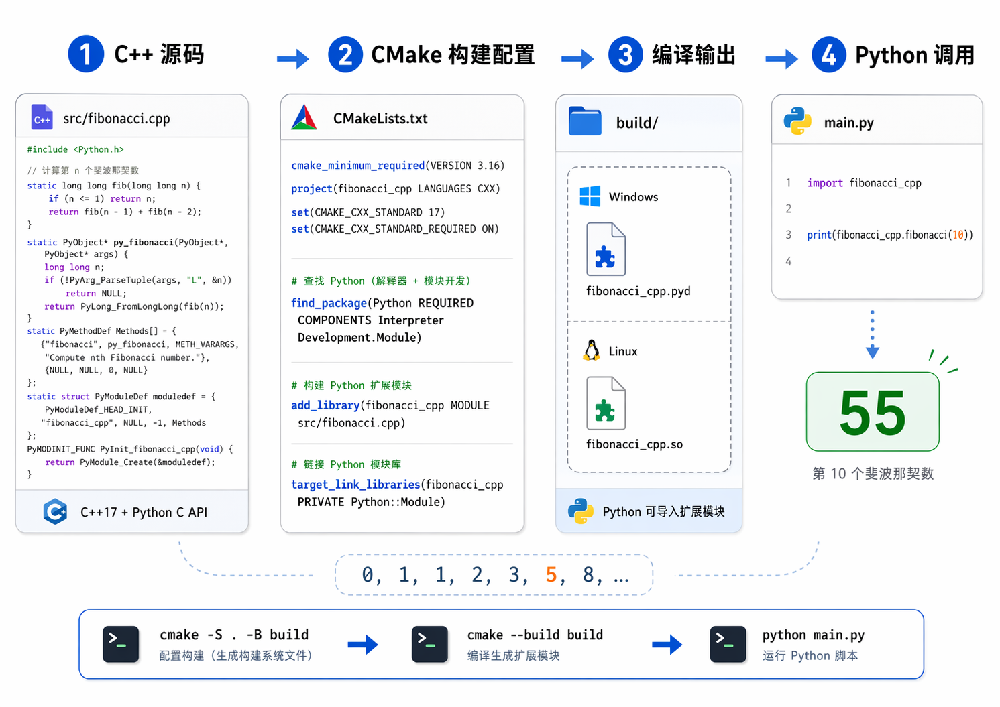

# Python から C++ 実装の Fibonacci を呼び出す

[English](../README.md) | [中文](README.zh-CN.md) | [日本語](README.ja.md) | [Français](README.fr.md) | [Deutsch](README.de.md)

このプロジェクトは、Fibonacci 計算を C++ で実装し、Python のネイティブ拡張モジュールとして呼び出す方法を示します。

ビルド後は、Python から次のように使用できます。

```python
import fibonacci_cpp

print(fibonacci_cpp.fibonacci(10))  # 55
```



## 必要環境

- Python 3.x
- CMake 3.18 以降
- MinGW、MSVC、Clang などの C++17 コンパイラ

必要なコマンドを確認します。

```powershell
python --version
cmake --version
g++ --version
```

Python 拡張モジュールは、ビルド時と実行時で同じ Python バージョンを使う必要があります。このプロジェクトの CMake 設定は、現在のコマンドライン `PATH` にある `python` を優先するため、`cmake --build build` で生成されたモジュールを `python main.py` から直接インポートできます。

特定の Python インタープリターを指定する場合は、次のように設定します。

```powershell
cmake -S . -B build -DPython_EXECUTABLE="C:\Users\YourName\miniconda3\python.exe"
```

## ビルド

プロジェクトのルートディレクトリで実行します。

```powershell
cmake -S . -B build
cmake --build build
```

ビルドが成功すると、`build` ディレクトリに次のようなファイルが生成されます。

```text
fibonacci_cpp.cp313-win_amd64.pyd
```

ファイル名の Python バージョンタグは環境によって異なります。たとえば `cp313` は CPython 3.13 を表します。

中心となる CMake 設定は次のとおりです。

```cmake
find_package(Python REQUIRED COMPONENTS Interpreter Development.Module)

add_library(fibonacci_cpp MODULE
    src/fibonacci.cpp
)

target_link_libraries(fibonacci_cpp PRIVATE Python::Module)
```

生成されるモジュール名は `fibonacci_cpp` なので、Python では `import fibonacci_cpp` として読み込みます。

## 使い方

`src/fibonacci.cpp` は Python C API を使って次の関数を公開しています。

```python
fibonacci_cpp.fibonacci(n)
```

注意点:

- `n` は 0 以上の整数である必要があります。
- 戻り値は Python の `int` なので、大きな整数にも対応できます。
- C++ 側では現在 `n` を `unsigned long long` として解析しているため、受け付ける最大インデックスは `18446744073709551615` です。実際に計算できる大きさはメモリと実行時間にも依存します。

デモを実行します。

```powershell
python main.py
```

より大きなベンチマークを実行します。

```powershell
python main.py 1000000
```

## Wall Time ベンチマーク

`main.py` は次の 2 つを行います。

- `fibonacci_cpp.fibonacci(0)` から `fibonacci_cpp.fibonacci(10)` までの小さな例を表示します。
- 同じ大きな `n` に対して、純粋な Python 実装と C++ 拡張の Wall Time を比較します。

デフォルトのベンチマーク:

```powershell
python main.py
```

実行例:

```text
Benchmark n = 100,000
Result decimal digits : 20,899
Python Wall Time     : 0.052376 s
C++ Wall Time        : 0.000816 s
Speedup              : 64.18x
```

`n = 1000000` の場合:

```powershell
python main.py 1000000
```

実行例:

```text
Benchmark n = 1,000,000
Result decimal digits : 208,988
Python Wall Time     : 4.540529 s
C++ Wall Time        : 0.033997 s
Speedup              : 133.56x
```

Wall Time はマシン、Python バージョン、コンパイラ、バックグラウンド負荷によって変わります。これらの数値は参考値です。より厳密に測定する場合は、複数回実行して平均を取るか、`pyperf` などの専用ツールを使ってください。

## ここで C++ が有利な理由

C++ 拡張は、計算量の多いホットパスに向いています。このプロジェクトでは次の点が効いています。

- Python 版は単純なループなので、各ステップで Python バイトコードの実行と変数束縛が発生します。
- C++ 拡張は重い計算部分をコンパイル済みモジュールへ移し、Python レベルのループオーバーヘッドを減らします。
- C++ 実装は高速倍加法を使い、通常の `O(n)` 反復ではなく、およそ `O(log n)` 回の大整数演算で Fibonacci を計算します。
- Python は呼び出し口と表示を担当し、C++ は重い計算を担当します。

すべての Python コードを C++ に移せば速くなるわけではありません。言語間呼び出しにもコストがあるため、この方法は計算量が多く、呼び出し回数が制御でき、ロジックが比較的安定している部分に向いています。

## 学習リソース

- Python 公式チュートリアル: Extending and Embedding the Python Interpreter  
  https://docs.python.org/3/extending/

- Python 公式リファレンス: Python/C API Reference Manual  
  https://docs.python.org/3/c-api/index.html

- Real Python チュートリアル: Building a Python C Extension Module  
  https://realpython.com/build-python-c-extension-module/

- よりモダンな C++ ラッパーとして pybind11 も参考になります  
  https://pybind11.readthedocs.io/
